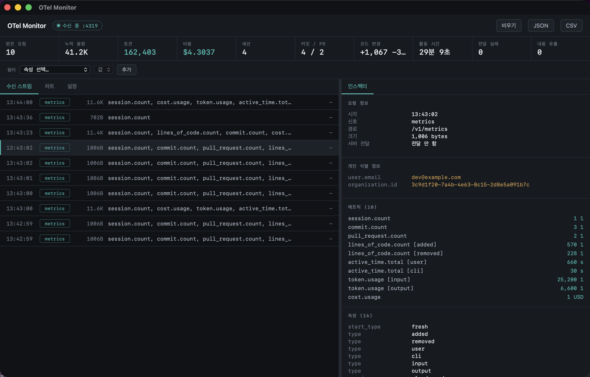

<div align="center">


# OTel Monitor

**Claude Code 의 텔레메트리를 눈으로 확인하는 macOS 앱**

[](#설치)
[](#설치)
[](LICENSE)


</div>

---

## 왜 만들었나

Claude Code 의 OpenTelemetry 를 켜면 사용량 메트릭이 주기적으로 수집 서버로 전송된다.
숫자 집계만 나가고 프롬프트·코드 원문은 나가지 않지만, 그걸 확인할 방법이 마땅치 않았다.

- 전송 성공·실패 기록이 로컬에 남지 않는다
- 실패는 `claude --debug` 로만 드러나 평소엔 알아채기 어렵다
- 설정을 바꿨을 때 실제로 무엇이 달라지는지 눈으로 볼 수 없다

그래서 중간에 세워두고 지나가는 걸 들여다보는 도구를 만들었다.

## 어떻게 동작하나

로컬에서 OTLP 를 받아 디코딩·기록한 뒤, 설정한 수집 서버로 **바이트를 그대로** 넘긴다.
기존 수집을 끊지 않고 내용만 들여다볼 수 있다.

```
Claude Code
    │  OTLP/HTTP (protobuf)
    ▼
OTel Monitor  :4319     ← 디코딩 · 기록 · 유출 감지
    │  원본 그대로 릴레이
    ▼
원래 수집 서버 (선택)
```

헤더까지 그대로 넘기므로 수집 서버 입장에서는 달라지는 게 없다.
전달할 서버를 비워두면 **로컬 전용 뷰어**로만 쓸 수도 있다.

## 화면

<div align="center">

</div>

| 영역 | 내용 |
|---|---|
| **상단 통계** | 받은 요청 · 누적 용량 · 토큰 · 비용 · 세션 · 커밋/PR · 코드 변경 · 활동 시간 · 전달 실패 · 내용 유출 |
| **수신 스트림** | 요청 하나하나를 시각 · 신호 종류 · 크기 · 메트릭명 · 응답과 함께 나열 |
| **인스펙터** | 선택한 요청의 전체 속성. 개인 식별 정보는 색으로 구분. 경계선을 드래그해 너비 조정 |
| **차트** | 누적 토큰 · 비용 시계열, 토큰 종류별(input/output/cacheRead/cacheCreation) 내역 |
| **설정** | 포트 · 전달 서버 · 전달 on/off, 테마(시스템/라이트/다크), 설정 파일 진단 |

### 내용 유출 감지

다음이 페이로드에 나타나면 상단에 배너로 알려준다.

- **로그(이벤트) 신호 자체** — `OTEL_LOGS_EXPORTER` 가 켜졌다는 뜻이다
- **내용 필드** — `prompt`, `response`, `tool_parameters`, `error`, `api_request_body` 등이
  비어 있지 않고 `<REDACTED>` 도 아닌 경우

설정 탭의 진단 기능은 `settings.json` 을 직접 읽어 내용 노출 키 6종이 켜져 있는지 확인해 준다.

## 설치

[Releases](../../releases) 에서 `.dmg` 를 받아 앱을 `Applications` 로 옮긴다.
Universal 빌드라 Intel · Apple Silicon 모두 동작한다 (macOS 13+).

### Claude Code 연결

설정 파일(`~/.claude/settings.json`)의 `env` 에 아래를 넣는다.

```jsonc
{
  "env": {
    "CLAUDE_CODE_ENABLE_TELEMETRY": "1",
    "OTEL_METRICS_EXPORTER": "otlp",
    "OTEL_EXPORTER_OTLP_PROTOCOL": "http/protobuf",
    "OTEL_EXPORTER_OTLP_ENDPOINT": "http://localhost:4319"
  }
}
```

이미 수집 서버를 쓰고 있다면 그 주소를 앱 설정의 **전달할 서버 주소** 에 넣는다.
앱이 받은 내용을 그대로 넘기므로 기존 수집은 그대로 유지된다.

> 이미 실행 중인 세션에는 반영되지 않는다. 새 터미널에서 `claude` 를 띄워야 한다.
> 첫 전송까지 최대 1분(기본 export 간격) 걸린다.

## 직접 빌드

```bash
pnpm install
pnpm tauri dev      # 개발
pnpm tauri build    # .app / .dmg
```

Rust 1.77+, Node 20+ 필요. 서명·공증 배포는 [docs/RELEASE-macos.md](docs/RELEASE-macos.md) 참조 —
인증서와 비밀번호는 전부 환경변수로 읽고 저장소에는 넣지 않는다.

## 잡히는 내용

Claude Code 가 내보내는 메트릭은 8종이 전부다.

| 메트릭 | 의미 |
|---|---|
| `session.count` | 세션 시작 횟수 |
| `lines_of_code.count` | 수정한 줄 수 (added/removed) |
| `commit.count` · `pull_request.count` | 커밋 · PR 개수 |
| `cost.usage` | 비용(USD) |
| `token.usage` | 토큰 (input/output/cacheRead/cacheCreation) |
| `code_edit_tool.decision` | 편집 권한 승인 · 거절 |
| `active_time.total` | 실제 활동 시간(초) |

값은 숫자 집계이고 대화 내용은 포함되지 않는다.
다만 로그인 상태에서는 `user.email`·`organization.id` 같은 식별 속성이 함께 붙는다 —
인스펙터가 이 속성들을 따로 표시해 준다.

## 만들면서 알게 된 것

- **헤드리스(`claude -p`)는 메트릭을 내보내지 않는다.** 대화형 세션에서만 export 가 돈다.
  테스트하다 한참 헤맸다.
- **cumulative temporality 를 조심해야 한다.** Claude Code 는 매 전송마다 "세션 시작 이후 누계"를
  통째로 다시 보낸다. 값을 더하면 중복 계상된다 — 시리즈별 최신값으로 덮어써야 맞다.
  처음에 `+=` 로 짰다가 커밋 수가 두 배로 뜨는 걸 보고 알았다.
- 콘솔 익스포터(`OTEL_METRICS_EXPORTER=console,otlp`)는 쉼표로 여러 개 지정이 되는데,
  출력이 어디로 가는지는 문서에 없다.
- Claude 설정 폴더의 `telemetry/` 디렉토리는 **Anthropic 자체 제품 분석**(`1p_failed_events`)이고
  OTel 과는 완전히 다른 계통이다. 헷갈리기 쉽다.

## 구조

```
src-tauri/src/
  otlp.rs    OTLP 수신 · protobuf 디코딩 · 유출 판정 · 라우팅
  state.rs   캡처 버퍼 · 누적 집계(cumulative) · 전달
  lib.rs     Tauri 커맨드 · 서버 기동
src/
  index.html  UI · 테마 토큰
  main.js     렌더링 · SVG 차트 · 리사이저 · 이벤트 수신
```

protobuf 는 `opentelemetry-proto` 크레이트로 정식 디코딩한다.
처음엔 바이너리에서 문자열만 긁어내는 방식으로 프로토타이핑했는데, 값이 자꾸 어긋나서 갈아엎었다.

## 안 하는 것

- **데이터를 외부로 보내지 않는다.** 캡처는 메모리에만 있고(최대 500건) 앱을 끄면 사라진다.
  남기려면 JSON/CSV 로 내보낸다.
- 지나가는 내용을 **바꾸지 않는다.** 감시용이지 차단용이 아니다.
- **앱을 꺼두면 그 구간은 전달되지 않는다.** 프록시를 중간에 두는 이상 피할 수 없는 부분이다.

## 라이선스

[MIT](LICENSE)
